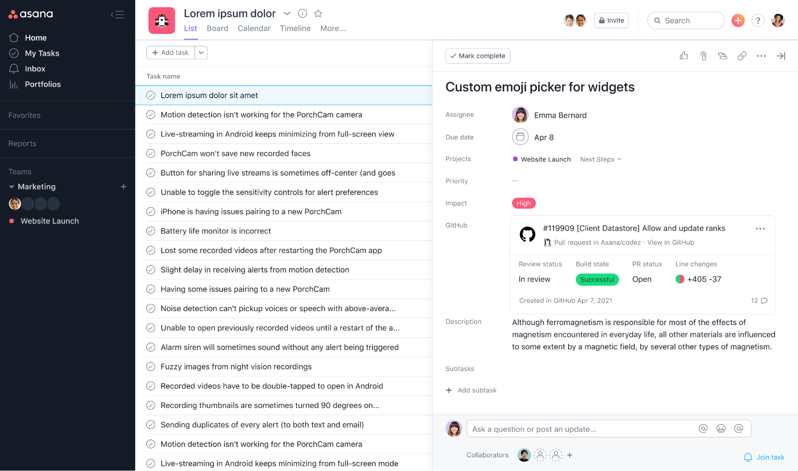
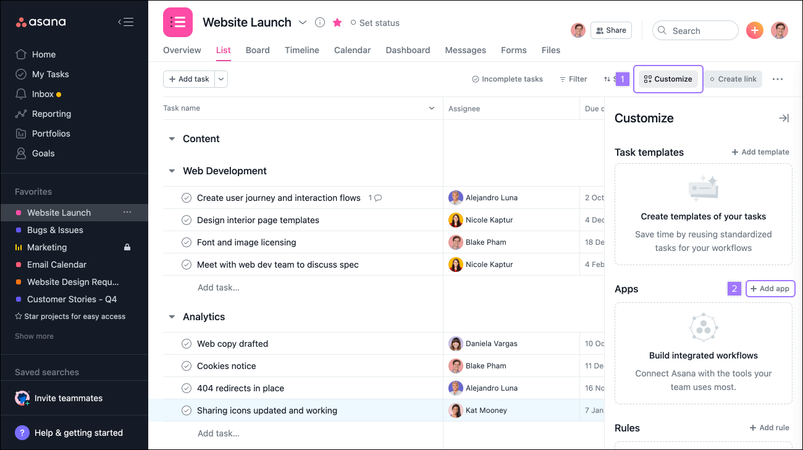
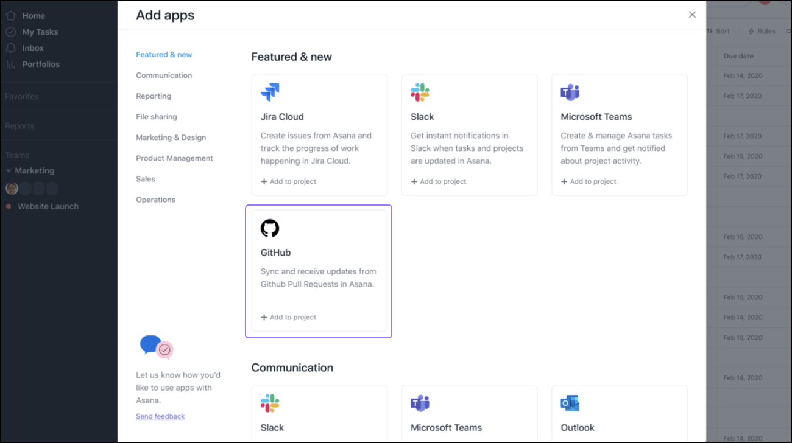

# Connect pull request attachments from GitHub to Asana

Always be in the loop on the status of a pull request with this GitHub Action, which connects an attachment to Asana.

How does it work? The GitHub Action will check the description of the pull request for the specific Asana task URL and automatically create an attachment with the latest status from GitHub as the authenticated user. 

This is available to all Asana users on Premium, Business, and Enterprise plans. 

To get notified when the pull request status changes in Asana, check out [GitHub Action](https://github.com/Asana/comment-on-task-github-action).

To learn more about using the GitHub + Asana integration, visit the [Asana Guide](https://asana.com/guide/help/api/github).



## Usage

#### Step 1: Generate a secret token for your Action

Skip this step if you've done this for a different GitHub action for this repository.

* Go to https://github.integrations.asana.plus/auth?domainId=ghactions
* Authorize the Asana app and the GitHub app
* Copy the generated secret. **Do not share this secret with anyone!**

At any point, you can revoke this generated token at https://github.integrations.asana.plus/auth?domainId=manage_tokens.

#### Step 2: Set up a repository secret for the secret token

Skip this step if you've done this for a different GitHub action for this repository.

* Go to settings page for your repository
* Click on *Secrets* on left sidebar
* Click **New repository secret**
* Create a new secret called `ASANA_SECRET` with value set to the secret token
* Click **Add secret**

#### Step 3: Create a workflow file

##### Quick Start for Unix Command Line
To get started quickly, `cd` into the GitHub repository root and checkout the main branch

```sh
cd <REPOSITORY ROOT>
git checkout main
```

Then, run the commands below from the command line to create a workflow file, commit the change, and push it to GitHub. 

```sh
mkdir -p .github/workflows && curl https://raw.githubusercontent.com/Asana/create-app-attachment-github-action/main/example-workflow-file.yaml --output .github/workflows/create-asana-attachment.yaml
git add .github/workflows/create-asana-attachment.yaml
git commit -m "automatically create Asana app attachments when opening pull requests"
git push
```

The action should work after this step and attach pull requests to Asana tasks whenever they are opened or reopened. You should now see a file called `.github/workflows/create-asana-attachment.yaml` in your repository on GitHub. Find out how to edit what events trigger the action and see detailed explanation in the next section.

##### Step-by-Step

Instead of running the commands in the previous section, you can create a YAML file with a name of your choosing in `.github/workflows/` directory (e.g., `.github/workflows/create-asana-attachment.yml`. You may have to create the directory.). We provide an example [`.github/workflows/create-asana-attachment.yml`](https://raw.githubusercontent.com/Asana/create-app-attachment-github-action/main/example-workflow-file.yaml) file below.

```yaml
on:
  pull_request:
    types: [opened, reopened]

jobs:
  create-asana-attachment-job:
    runs-on: ubuntu-latest
    name: Create pull request attachments on Asana tasks
    steps:
      - name: Create pull request attachments
        uses: Asana/create-app-attachment-github-action@latest
        id: postAttachment
        with:
          asana-secret: ${{ secrets.ASANA_SECRET }}
      - name: Log output status
        run: echo "Status is ${{ steps.postAttachment.outputs.status }}"
```

The workflow set up in the file above will run whenever a pull request is opened or reopened. This GitHub action only runs in the context of a pull request so the event triggers must either be the [`pull_request`](https://docs.github.com/en/developers/webhooks-and-events/webhooks/webhook-events-and-payloads#pull_request) event, the [`pull_request_review_comment`](https://docs.github.com/en/developers/webhooks-and-events/webhooks/webhook-events-and-payloads#pull_request_review_comment) event, or the [`pull_request_review`](https://docs.github.com/en/developers/webhooks-and-events/webhooks/webhook-events-and-payloads#pull_request_review) event. 

Once this file is set up, commit and push your change to the **main branch of your repository.** The GitHub action is now set up, congratulations!

#### Step 4: Enable the GitHub integration in your Asana project (optional)



- Navigate to a project where you would like to activate the integration 
- Click on the Customize Menu drop-down in the right-hand corner (1)
- Select **+Add app** (2)



- Select **GitHub**
- You’ll be prompted to authorize your GitHub account. Please follow the instructions
- The GitHub integration will be installed at a project level. In the following screen, you can select the projects you would like to add the integration to
- Now, you can use the GitHub integration in any of the projects to which it has been added


#### Step 5: Adapt the GitHub Action to your workflow (optional)

##### Available parameters

*Required*:
* ```asana-secret``` - Should contain the Asana secret from Step 3

*Optional*:
* ```allowed-projects``` - List of Asana projects IDs where attachments can be added
* ```blocked-projects``` - List of Asana projects IDs where attachments cannot be added


If values are provided for neither the `allowed-projects` parameter or the `blocked-projects` parameter, the GitHub action will be able to add attachments to any task. Providing values for both ```allowed-projects``` and ```blocked-projects``` lists at the same time will result in an error.

In the workflow file below, we provide an allowlist to the GitHub Action. The Action will only create pull request attachments on tasks that are in project 1125036528002799 or 1192160553314033. 

```yaml
jobs:
  create-asana-attachment-job:
    runs-on: ubuntu-latest
    name: Create pull request attachments on Asana tasks
    steps:
      - name: Create pull request attachments
        uses: Asana/create-app-attachment-github-action@latest
        id: postAttachment
        with:
          asana-secret: ${{ secrets.ASANA_SECRET }}
          allowed-projects: |
            1125036528002799
            1192160553314033
      - name: Get status
        run: echo "Status is ${{ steps.postAttachment.outputs.status }}"
```

In the workflow file below, we provide a blocklist to the GitHub Action. The Action will only create pull request attachments on tasks that are **not** in project 1125036528002799 or 1192160553314033.

```yaml
jobs:
  create-asana-attachment-job:
    runs-on: ubuntu-latest
    name: Create pull request attachments on Asana tasks
    steps:
      - name: Create pull request attachments
        uses: Asana/create-app-attachment-github-action@latest
        id: postAttachment
        with:
          asana-secret: ${{ secrets.ASANA_SECRET }}
          blocked-projects: |
            1125036528002799
            1192160553314033
      - name: Get status
        run: echo "Status is ${{ steps.postAttachment.outputs.status }}"
```

#### Revoking your secret token

If at any point you want to stop using your GitHub action or want to rotate your secret token, you may invalidate all of your tokens at https://github.integrations.asana.plus/auth?domainId=manage_tokens

## Contributing

### Unit tests

Unit tests should be run via npm command:

```npm run test```

### Formatting and Linting

```npm run lint```
